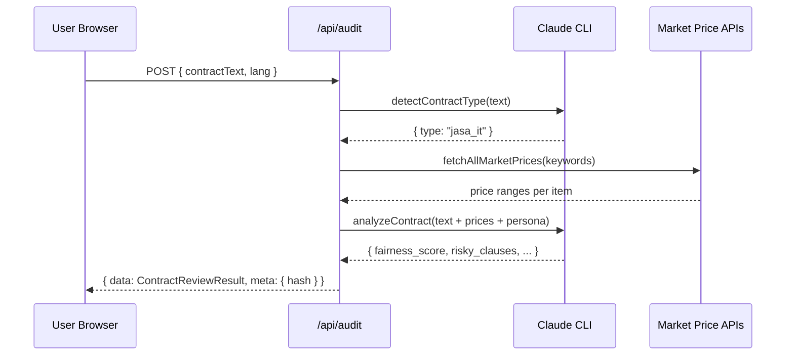

# System Architecture Overview

## High-Level Architecture

```mermaid
graph TB
    subgraph Browser["User Browser"]
        UI["Next.js Frontend\nApp Router\n/audit · /create · /dashboard"]
        Wallet["Phantom Wallet\nExtension"]
    end

    subgraph NextAPI["Next.js API Routes"]
        upload["/api/upload\npdf-parse"]
        audit["/api/audit\n/api/audit-stream"]
        checkpoint["/api/checkpoint"]
        chat["/api/chat-contract"]
    end

    subgraph AI["AI Layer"]
        cli["Claude Code CLI\nSubprocess\nclaude -p '...'"]
        prompt["agent/CLAUDE.md\nSystem Prompt\nExpert Personas · Law Refs"]
        prices["Market Price APIs\nBlibli · SerpAPI"]
    end

    subgraph Solana["Solana Devnet"]
        program["ContractGuard Program\n2Htsz7Xf4YWZTc8t..."]
        config["Config PDA"]
        contract["Contract PDA\n+ USDC Escrow"]
        mint["USDC Mint PDA"]
        ata["User ATAs"]
    end

    UI --> NextAPI
    NextAPI --> cli
    cli --> prompt
    cli --> prices
    UI --> Wallet
    Wallet --> program
    program --> config
    program --> contract
    program --> mint
    program --> ata

    style Browser fill:#1a1a2e,stroke:#9945FF
    style NextAPI fill:#0d1f1a,stroke:#14F195
    style AI fill:#1a0d2e,stroke:#9945FF
    style Solana fill:#0d1a2d,stroke:#38BDF8
```



---

## Data Flow — Contract Audit



---

## Key Architectural Decisions

### 1. Claude CLI as Subprocess (not API)
The AI layer calls `claude -p "..."` as a child process instead of using the Anthropic API directly.

**Why:**
- No API key billing in `.env` — uses the developer's authenticated Claude CLI session
- The agent's `CLAUDE.md` system prompt lives in `agent/CLAUDE.md`, kept outside the web request path
- Output is captured as JSON, parsed, and returned to the browser

**Tradeoff:** The Claude CLI must be installed and authenticated on the server machine.

### 2. No External State Management
All UI state uses React's built-in hooks and Context API:
- `LanguageProvider` — EN/ID switching
- `ThemeProvider` — dark/light theme + CSS variables
- `WalletProvider` — Solana wallet connection

No Redux, Zustand, or similar libraries — keeps the bundle lean.

### 3. Anchor IDL for Type-Safe Blockchain Calls
The Solana program's IDL (`app/lib/idl.ts`) is imported to create an Anchor `Program` client. This provides type-safe method calls matching the on-chain program instructions exactly.

### 4. PDA-Based Contract Identity
Every on-chain contract is a Program Derived Address seeded with `[client_pubkey, contractor_pubkey, created_at_timestamp]`. Contracts are deterministically addressable with no central registry.

---

## Directory Map

```
frontend/
├── app/
│   ├── page.tsx              ← Landing page
│   ├── layout.tsx            ← Root layout + all providers
│   ├── globals.css           ← CSS variables + base styles
│   ├── audit/page.tsx        ← Audit feature
│   ├── create/page.tsx       ← Create & deploy contract
│   ├── dashboard/
│   │   ├── page.tsx          ← Contract list
│   │   └── [id]/page.tsx     ← Contract detail + milestones
│   ├── pricing/page.tsx      ← Pricing tiers
│   ├── api/                  ← Next.js API routes (server-side)
│   ├── components/           ← Reusable React components
│   ├── lib/                  ← Utilities, hooks, AI agent
│   └── i18n/                 ← Translation dictionaries
├── agent/                    ← Claude agent system prompt (CLAUDE.md)
├── public/                   ← Static assets
├── docs/                     ← This GitBook documentation
└── .env.local                ← Environment config
```
