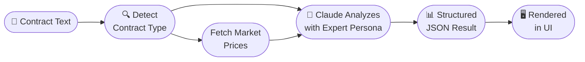

# Contract Audit

**Route:** `/audit`  
**File:** `app/audit/page.tsx`

The Audit page is the starting point for every contract workflow. It analyzes a contract for fairness, risks, and price accuracy — in under 30 seconds.

---

---

## Input Methods

### 1. Upload PDF
- Drag-and-drop or click to upload a `.pdf` file
- Sent to `/api/upload`, extracted via `pdf-parse`, raw text returned
- Best for: contracts received as official documents

### 2. Paste Text
- Click the **Text** tab and paste raw contract text directly
- Best for: contracts in Google Docs, email, or any digital format

---

## Analysis Process

**Time:** 5–30 seconds depending on model and contract length.

For long contracts, the streaming endpoint (`/api/audit-stream`) shows live progress so you're never staring at a blank screen.

---

## Output Sections

### Fairness Score

A single score from **1–10** representing overall contract balance:

| Score | Rating | Color | Recommended Action |
|-------|--------|-------|-------------------|
| 8–10 | Fair | Green | Safe to proceed |
| 5–7 | Concerns | Yellow | Review flagged clauses |
| 1–4 | Imbalanced | Red | Request revisions |

---

### Risky Clauses

Each flagged clause includes:
- **Risk level** badge: `HIGH` / `MEDIUM` / `LOW`
- **Exact clause text** from the contract
- **Plain-language explanation** of why it's risky
- **Suggested revision** to make it fair

---

### Price Analysis

Line-by-line comparison against real Indonesian market data:
- Item name and contracted price
- Market price range (from Blibli, Google Shopping, SerpAPI)
- Status badge: `OVERPRICED` / `FAIR` / `UNDERPRICED`
- Notes explaining the discrepancy

---

### Regulation Compliance

Checks relevant Indonesian laws based on the detected contract type. Each check shows:
- Regulation reference (e.g., *Perpres No. 16/2018 Pasal 7*)
- Compliance status: ✅ Compliant / ⚠️ Non-compliant
- Specific notes on what needs to change

---

### Revision Suggestions & Uncertainty Questions

- **Revision Suggestions** — actionable bullet points for improving contract balance
- **Uncertainty Questions** — ambiguous clauses the AI flagged for clarification with the other party

---

## Audit Hash

After analysis, a **SHA-256 hash** of the audit result is displayed.

This hash:
- Proves the contract was audited before deployment
- Is recorded on-chain when you deploy the contract
- Can be used to verify audit integrity at any time

---

## Next Step

After auditing, deploy the contract → [Create Contract](create-contract.md)
