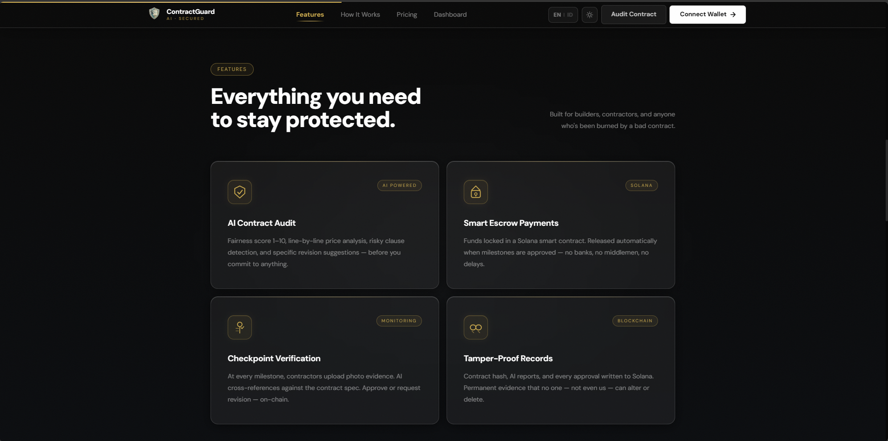
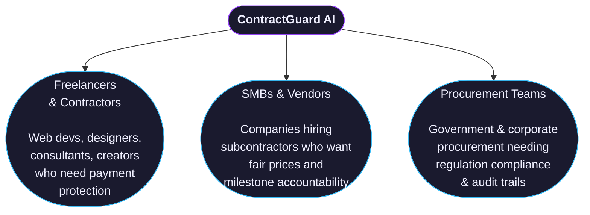

# Why ContractGuard

## There's Nothing Else Like This in Indonesia

There are AI tools. There are escrow services. There are contract templates. But there is no product that combines all three — with deep Indonesian context — the way ContractGuard does.

---

*ContractGuard feature overview section on the landing page*

---

## vs. Hiring a Lawyer

| | Lawyer | ContractGuard |
|--|--------|--------------|
| Cost | Rp 2,000,000–10,000,000+ per review | **Free during beta** |
| Turnaround | Days to weeks | **Under 30 seconds** |
| Available 24/7 | No | **Yes** |
| Market price data | No | **Yes — real-time Indonesian markets** |
| On-chain enforcement | No | **Yes — Solana escrow** |
| Understands IT/tech contracts | Sometimes | **Always** |

> Lawyers are indispensable for complex litigation. For standard freelance and procurement contracts, ContractGuard is faster, cheaper, and handles 90% of the same checks.

---

## vs. Generic AI Chatbots (ChatGPT, Gemini)

| | General AI | ContractGuard |
|--|------------|--------------|
| Indonesian law knowledge | Generic phrases | **Deep — UU, PP, Perpres, KUH Perdata** |
| Contract-type expertise | Generic | **8 specialized Indonesian contract types** |
| Market price benchmarking | No | **Yes — Blibli, SerpAPI, Google Shopping** |
| Structured audit output | No | **Yes — scores, clause-by-clause JSON** |
| Blockchain integration | No | **Yes — direct Solana deployment** |
| Milestone verification | No | **Yes — AI reviews submitted evidence** |

**General AI gives you a conversation. ContractGuard gives you a verdict.**

---

## vs. Freelance Platform Escrow (Upwork, Freelancer.com)

| | Platform Escrow | ContractGuard |
|--|----------------|--------------|
| Requires platform account | Yes | **No — just a wallet** |
| Platform fee | 10–20% | **None** |
| Contract audit before signing | No | **Yes** |
| Dispute resolution | Platform decides | **AI verifies, you decide** |
| Works outside the platform | No | **Yes — any contract, any parties** |
| Transparent fund management | No | **Yes — on-chain, publicly auditable** |

Platform escrow locks you into their ecosystem and their fees. ContractGuard is open, permissionless, and free.

---

## vs. Manual BAST / Milestone Process

```mermaid
flowchart LR
    subgraph OLD ["Manual BAST Process"]
        direction TB
        O1([Fill Word/PDF docs]) --> O2([Get physical signatures])
        O2 --> O3([File with procurement office])
        O3 --> O4([Wait for approval committee])
        O4 --> O5([⏳ Weeks pass])
    end

    subgraph NEW ["ContractGuard"]
        direction TB
        N1([Submit evidence in dashboard]) --> N2([AI reviews in seconds])
        N2 --> N3([Client approves — 1 click])
        N3 --> N4([Funds released instantly])
    end

    style OLD fill:#2d1b1b,stroke:#ff4444
    style NEW fill:#0d1f1a,stroke:#14F195
```

---

## Our Unfair Advantages

### 1. Built for Indonesia — Not Translated

We're not a generic tool with a Bahasa Indonesia toggle. ContractGuard was designed from day one around Indonesian contract law, Indonesian pricing data, and Indonesian business culture.

The AI knows the difference between **Pengadaan Barang** and **Jasa Konsultasi** and applies the right regulations, the right expert persona, and the right compliance checks for each — automatically.

### 2. Claude AI — The Best Model Available

ContractGuard uses **Claude by Anthropic** — consistently ranked the top AI model for legal reasoning, nuance, and following complex instructions. The difference shows in contract analysis quality: it doesn't just flag keywords, it understands clause intent.

You choose the model based on the contract stakes:
- **Haiku** — fast, for quick checks
- **Sonnet** — balanced, for daily use
- **Opus** — maximum depth, for high-value contracts

### 3. Solana — Fast, Cheap, Trustless

Most blockchain escrow implementations are too slow or too expensive for everyday use. Solana transactions confirm in under a second and cost less than a fraction of a cent.

The escrow is enforced by code — not ContractGuard's word, not a bank's policy, not a platform's dispute team. The smart contract is immutable and publicly verifiable.

### 4. No Middleman, No Fees

ContractGuard does not hold your escrow. We do not approve your milestones. We do not charge a percentage of your contract value.

The smart contract does everything. We just built the interface.

---

## Who ContractGuard Is Built For

---

## Roadmap

What's live today, and what's coming next — with honest status labels.

### What's Live Now (Hackathon Build)

| Feature | Status |
|---------|--------|
| AI contract audit — fairness score, risky clauses, price analysis | ✅ Live |
| Regulation compliance check (8 Indonesian contract types) | ✅ Live |
| Contract deployment to Solana Devnet with USDC escrow | ✅ Live |
| Milestone submission & AI evidence verification | ✅ Live |
| Client milestone approval & on-chain fund release | ✅ Live |
| Mock USDC faucet (1,000 USDC/day per wallet) | ✅ Live |
| Bilingual UI — English & Bahasa Indonesia | ✅ Live |
| Dark mode & light mode | ✅ Live |

### In Progress (Post-Hackathon v1.1)

| Feature | Status | Notes |
|---------|--------|-------|
| Price Scraper v2 — more Indonesian market sources | 🔨 Building | Tokopedia, Shopee integration |
| AI Chat Q&A — ask anything about your contract | 🔨 Building | `/api/chat-contract` endpoint ready, UI in progress |
| Streaming audit progress | 🔨 Building | `/api/audit-stream` endpoint ready |

### Planned (v1.2)

| Feature | Status | Notes |
|---------|--------|-------|
| Contract Templates Library | 📋 Planned | 10 pre-audited Indonesian contract templates |
| Multi-signature Milestone Approval | 📋 Planned | Require 2-of-3 approvers for large contracts |
| Audit History & On-chain Proof Export | 📋 Planned | PDF certificate of audit for procurement files |

### Long-Term Vision (v2.0)

| Feature | Status |
|---------|--------|
| On-chain dispute arbitration with AI evidence review | 🔮 Roadmap |
| Mobile app (iOS/Android) | 🔮 Roadmap |
| Mainnet deployment (real USDC) | 🔮 Roadmap |

---

[Get started now →](../getting-started/installation.md)
